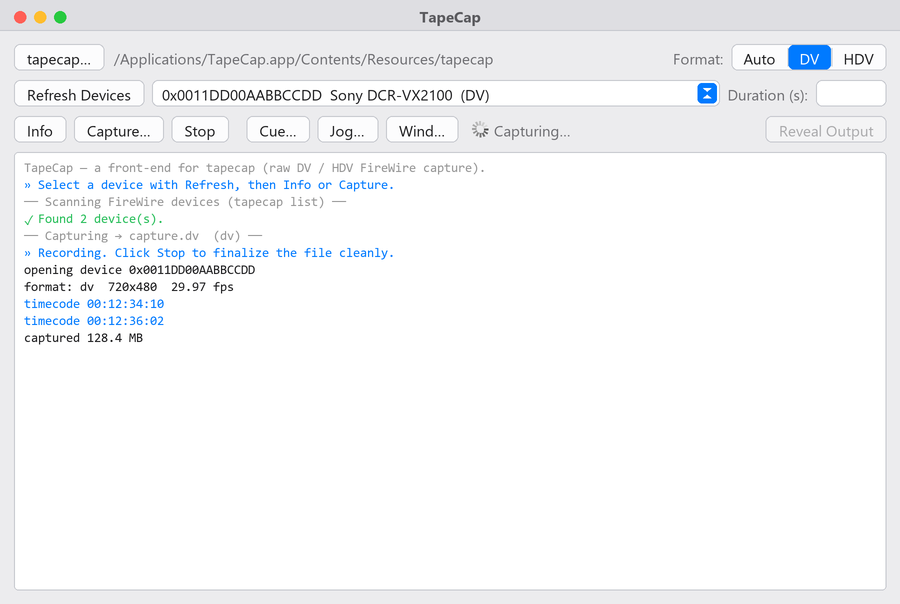
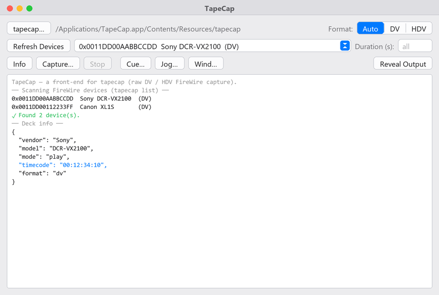

# TapeCap

A native macOS front-end for **[tapecap](https://github.com/xingrz/tapecap)** —
raw **DV / HDV tape capture over FireWire**. One window: pick your deck, choose a
format, and capture, with a colored, streaming log so you always see what the
deck is doing.

It reimplements **none** of tapecap's logic. It runs the real `tapecap` binary
and streams its output — the same commands you'd type by hand, driven from
buttons. Re-implementing IEC 61883 capture would only be a riskier copy of a
solved problem, so this tool deliberately stops at "drive tapecap, show you
everything."

---

## What it does

- **Select device** — lists FireWire AV/C decks (`tapecap list`) into a picker;
  the chosen deck's GUID is passed to every command.
- **Info** — the deck's mode, timecode and format (`tapecap info --json`).
- **Capture** — pick Auto / DV / HDV and an output file, then capture with a live
  colored log (runs with `--verbose`). **Stop** finalizes the file cleanly.
- **Transport** — **Cue** to a timecode, **Jog** forward/back, **Wind** to
  start/end, without capturing.

---

## Screenshots

Capturing — device picker, format selector, and a colored streaming log with live
timecode; **Stop** finalizes the file:



After **Refresh Devices** + **Info** — the parsed device list and the deck's
mode / timecode / format:



<sub>Rendered previews of the app's real layout and log output (built on a Windows
dev box; swap in live macOS captures anytime).</sub>

---

## Requirements

| Thing | How to get it |
| --- | --- |
| **macOS** with a FireWire AV/C deck | this is what tapecap supports |
| **`tapecap`** | **its source is vendored in `vendor/tapecap/`** — `build-app.command` compiles it and bundles the binary into the app, offline. Nothing to download or install separately. (At runtime the app also falls back to a copy on your `PATH` or one you pick with the **tapecap…** button.) |
| **Apple Command Line Tools** (to build the app) | `xcode-select --install` — free, gives you `swiftc` |

---

## Build the app

Run this **on the Mac**, in this folder (it also holds `TapeCap.swift`,
`tapecap-gui.command` and `AppIcon.png`):

```bash
bash build-app.command
```

It produces **`TapeCap.app`** next to the script and reveals it in Finder. It
picks the best UI your Mac can compile, in this order:

1. **Native Swift app** (preferred) — one window with the device picker, format
   selector, action buttons and the colored streaming log. Needs `swiftc` from
   the Command Line Tools above.
2. **Platypus text-window app** — log in-app, input via dialogs. Needs the
   [Platypus](https://sveinbjorn.org/platypus) CLI.
3. **Terminal-log fallback** — a plain `.app` whose launcher shows the log in
   Terminal. Always available.

The icon (`AppIcon.png`) is baked into `.icns` automatically with `sips` +
`iconutil`.

### tapecap is built in (self-contained app)

tapecap's **source is vendored in `vendor/tapecap/`** (MIT-licensed, ~1 MB,
AVCVideoServices included). The normal build compiles it in place and bundles the
resulting binary into the app — **no separate download, no separate folder, no
network.** `build-app.command` picks the binary in this order:

1. **`bash build-app.command`** — compiles `vendor/tapecap/` (`make` → `build/tapecap`)
2. `bash build-app.command --build` — force a fresh rebuild of the vendored source
3. `bash build-app.command /path/to/tapecap` — bundle a prebuilt binary you supply
4. a `tapecap` binary sitting next to `build-app.command`
5. only if `vendor/tapecap/` is missing does it fall back to `git clone` + build

The chosen binary is copied into `TapeCap.app/Contents/Resources/tapecap`, and the
app prefers that bundled copy — so the finished `.app` is fully self-contained.
The build's final message says whether tapecap was bundled.

Building the vendored source needs only **Xcode Command Line Tools**
(`xcode-select --install` — the same `clang++` the Swift app uses; no full Xcode,
no `swiftc`).

> Notes: `tapecap` is macOS-only (it links Apple's AVCVideoServices / IOKit
> FireWire frameworks), so it can only be built or bundled on a Mac — never on
> Windows/Linux. The build needs a macOS SDK that still ships the FireWire
> headers (SDK ≤ 15, i.e. up to Sequoia); Apple removed them in macOS 26.
>
> Updating the vendored copy later: replace `vendor/tapecap/` with a fresh
> checkout of xingrz/tapecap, or run `bash build-app.command --build` after
> `git -C vendor/tapecap pull` if you keep it as a checkout.

Move `TapeCap.app` to `/Applications` and double-click it. First launch on an
unsigned app: **right-click → Open** once (standard macOS Gatekeeper).

---

## Files

| File | Role |
| --- | --- |
| `TapeCap.swift` | the native single-window AppKit app (buttons + colored log) |
| `tapecap-gui.command` | `osascript` wrapper used by the Platypus / Terminal fallbacks — also runnable on its own (`bash tapecap-gui.command`) |
| `build-app.command` | assembles `TapeCap.app` (Swift → Platypus → Terminal) and builds + bundles tapecap |
| `vendor/tapecap/` | vendored tapecap source (MIT) — compiled and bundled into the app |
| `AppIcon.png` | 1024×1024 app icon |

---

## Notes

- The device list is parsed leniently: any line from `tapecap list` containing a
  `0x…` GUID becomes a selectable device, so it survives formatting changes in
  tapecap. The raw output is always in the log.
- Log colors come from this app's `✓ ✗ ! »` markers and from tapecap's own status
  and timecode lines — tapecap needs no ANSI/tty tricks.
- Piping to `ffmpeg` (`tapecap capture --no-control -`) is a command-line
  workflow; TapeCap targets file capture. Use the CLI directly for pipes.

## Credits & license

TapeCap is a GUI wrapper. The capture engine is **tapecap** by
[@xingrz](https://github.com/xingrz/tapecap) — MIT-licensed and vendored,
unmodified, in [`vendor/tapecap/`](vendor/tapecap) (see its own
[`LICENSE`](vendor/tapecap/LICENSE); it in turn bundles Apple's AVCVideoServices
sample code). All the FireWire capture work is tapecap's; this project only adds
the macOS app around it.

The TapeCap wrapper — `TapeCap.swift`, `build-app.command`, `tapecap-gui.command`
and the icon — is MIT-licensed, see [`LICENSE`](LICENSE).

SPDX-License-Identifier: MIT
